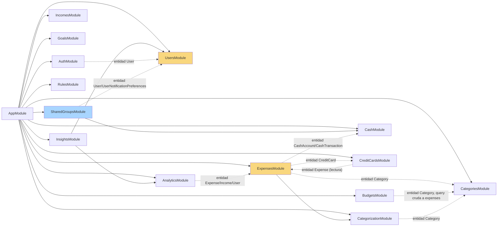
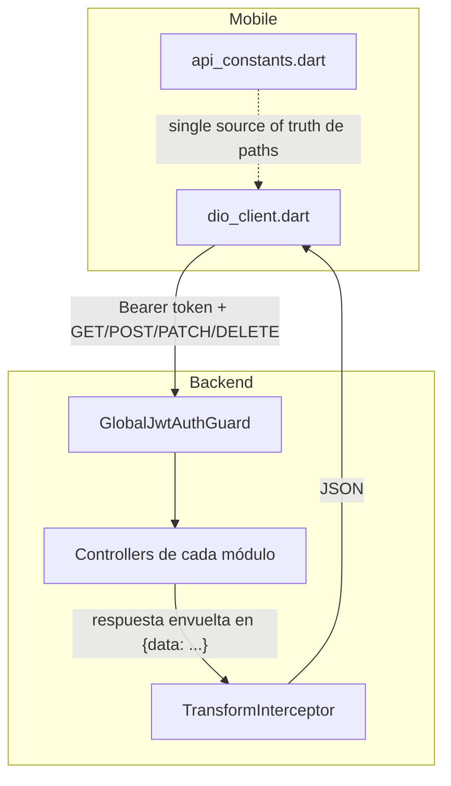
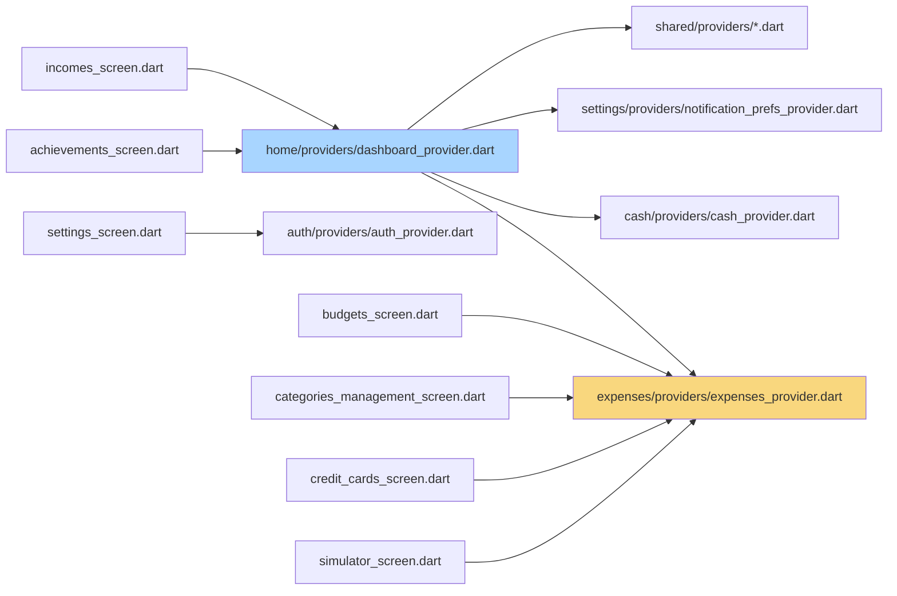
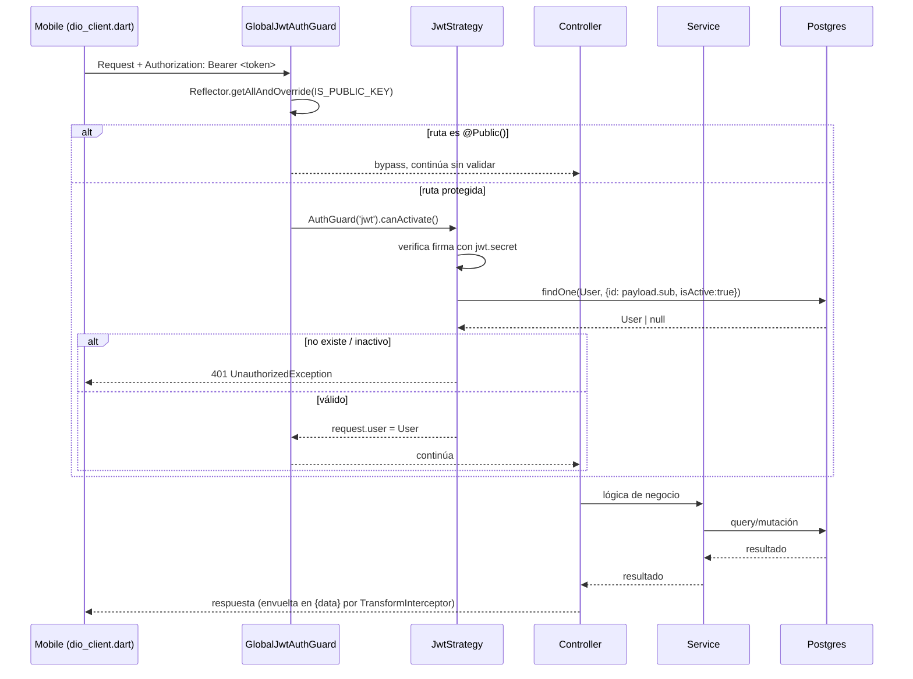
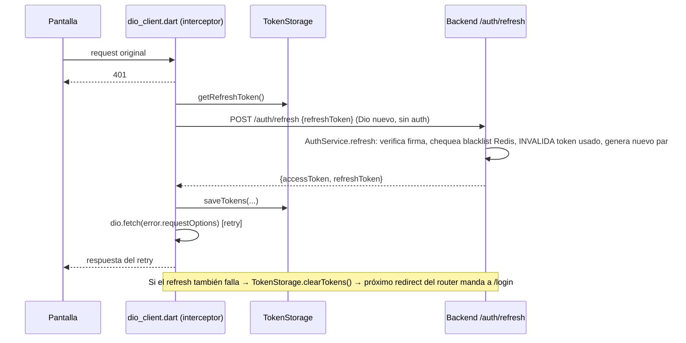
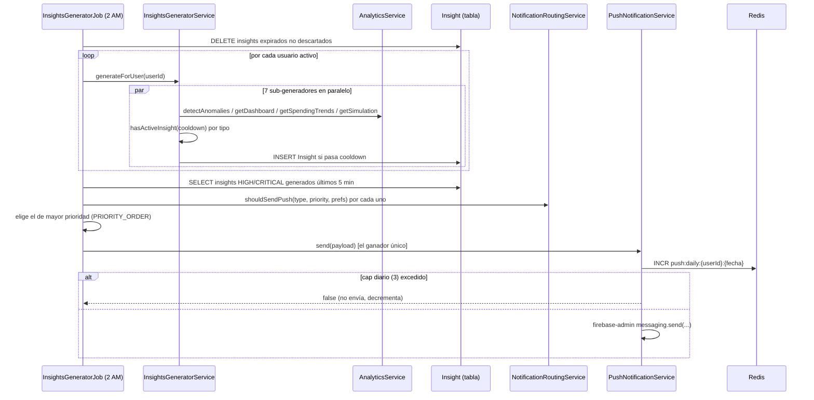
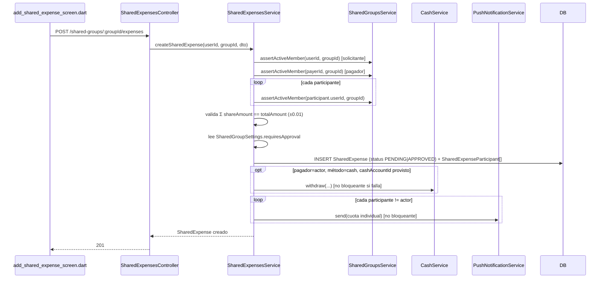
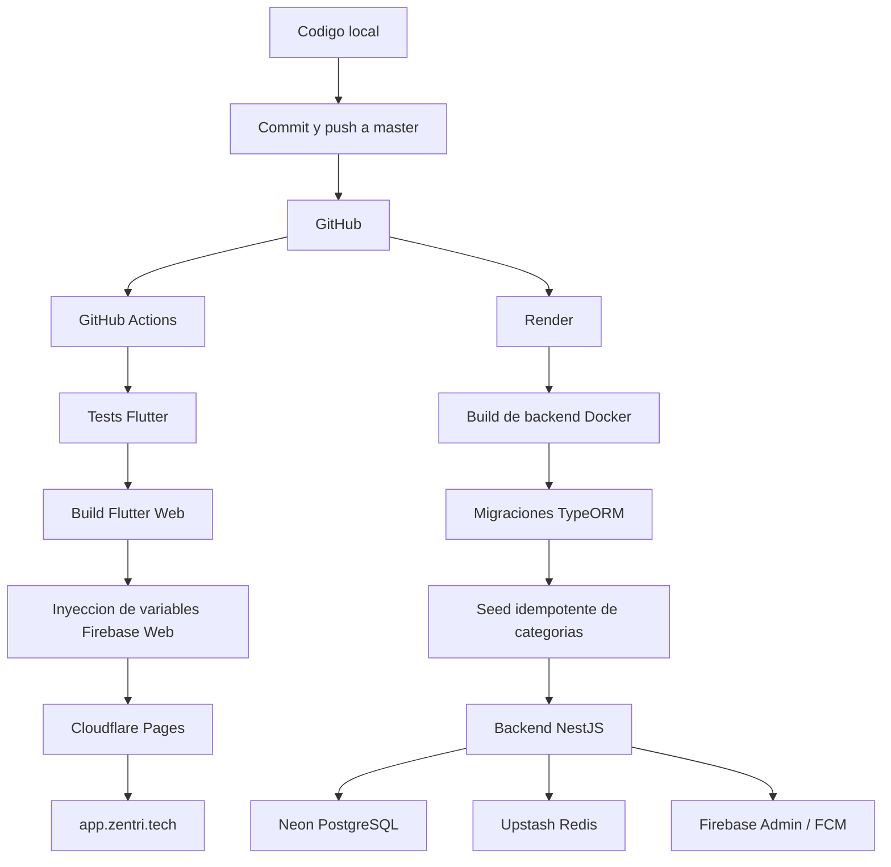

# ARCHITECTURE_KNOWLEDGE.md — Zentri

> Documento de mantenimiento, complementario a [`CODEBASE_MAP.md`](./CODEBASE_MAP.md). `CODEBASE_MAP.md` responde "¿qué hace cada archivo?"; este documento responde "¿qué se rompe si lo cambio?". **Consulta este archivo antes de re-analizar el repositorio.** Actualízalo cuando: se agregue/elimine un módulo, cambie una relación de entidades, o se resuelva/introduzca deuda técnica relevante.

---

## Cómo usar este documento

| Pregunta | Sección a consultar |
|---|---|
| ¿Dónde está implementada esta funcionalidad? | [Mapa de Imports](#mapa-de-imports-backend) + `CODEBASE_MAP.md` → Índice de Búsqueda |
| ¿Qué archivos debo modificar para cambiar X? | [Call Chains](#call-chains) + [Puntos de Extensión](#puntos-de-extensión) |
| ¿Qué impacto tendría cambiar Y? | [Dependencias entre Módulos](#dependencias-entre-módulos-backend) + [Áreas de Alto Riesgo](#áreas-de-alto-riesgo) |
| ¿Qué dependencias podrían romperse? | [Mapa de Imports](#mapa-de-imports-backend) (acoplamientos cruzados) + [Deuda Técnica](#deuda-técnica-identificada) |

---

## Dependencias entre Módulos (Backend)

### Grafo de dependencias de módulos NestJS



**Leyenda**: flechas sólidas = `import` de módulo Nest (`imports: [...]`). Flechas punteadas = acoplamiento por **entidad TypeORM compartida** (un módulo importa directamente la entidad `.entity.ts` de otro módulo, sin pasar por su service exportado). `ExpensesModule` y `UsersModule` están resaltados porque son los nodos con más entrantes — son los módulos de mayor "radio de explosión" ante un cambio.

### Tabla de imports de módulo a módulo (`imports: [...]` reales en `*.module.ts`)

| Módulo | Importa módulo | Por qué |
|---|---|---|
| `ExpensesModule` | `CategorizationModule` | Necesita `ExpenseCategorizationService`/`CategorizationLearningService` inyectables |
| `InsightsModule` | `AnalyticsModule`, `UsersModule` | Necesita `AnalyticsService` (fuente de datos) y servicios de usuario/preferencias |
| `SharedGroupsModule` | `CashModule` | Necesita `CashService` para impacto en efectivo de gastos compartidos/liquidaciones |
| `AppModule` | Los 14 módulos de feature + `AuthModule` | Composición raíz |

**Observación clave**: la mayoría de módulos **no** se importan entre sí formalmente — el acoplamiento real ocurre porque registran las mismas entidades TypeORM en su propio `TypeOrmModule.forFeature([...])` e importan el `.entity.ts` directamente (ver tabla de imports cruzados abajo). Esto funciona en runtime (TypeORM permite registrar la misma entidad en múltiples módulos) pero **no es el patrón modular "limpio"** de Nest (que sería exportar un service e importar el módulo).

### Imports cruzados de entidades (acoplamiento implícito)

| Entidad consumida | Módulos que la importan directamente (fuera de su propio módulo) |
|---|---|
| `User` (`users/user.entity.ts`) | **Casi todos**: `auth`, `expenses`, `incomes`, `budgets`, `cash`, `goals`, `credit-cards`, `categories`, `categorization`, `analytics`, `insights`, `rules`, `shared-groups` |
| `Expense` (`expenses/expense.entity.ts`) | `cash` (FK `expenseId`), `credit-cards` (lectura para resumen), `categories` (relación inversa), `analytics`, `insights`, `rules` (evaluador), `users` (relación `OneToMany`) |
| `Category` (`categories/category.entity.ts`) | `expenses`, `budgets`, `categorization` (las 3 entidades del motor), `users` |
| `CashAccount`/`CashTransaction` (`cash/*.entity.ts`) | `expenses.module.ts` registra **ambas entidades en su propio `forFeature`** (no importa `CashModule`) — duplicación de registro entre `ExpensesModule` y `CashModule` |
| `CreditCard` (`credit-cards/credit-card.entity.ts`) | `expenses` (FK `creditCardId`) |
| `UserNotificationPreferences` | `shared-groups`, jobs (vía `AppModule`) |

⚠️ **Riesgo de este patrón**: si renombras/eliminas una columna de `User`, `Expense` o `Category`, el blast radius cruza módulo sin que `imports: []` de ningún `.module.ts` te lo advierta — debes grepear el nombre de la entidad, no leer `app.module.ts`.

### Backend ↔ Mobile (contrato de API)



El contrato implícito es: **toda respuesta exitosa del backend va envuelta en `{data: ...}`** (`TransformInterceptor`), y `dio_client.dart` la desempaqueta automáticamente en un interceptor de respuesta. Si un controller backend devuelve algo que `TransformInterceptor` no envuelve igual (p.ej. el CSV de exportación, que se envía como texto plano con headers `Content-Type: text/csv`), el mobile debe tratarlo como caso especial (ver `exportGroupCsv` en `shared_expenses_provider.dart`, que maneja el unwrap condicionalmente).

---

## Dependencias entre Features (Mobile)



**`expenses_provider.dart` es el archivo más reusado del mobile** (exporta `categoriesProvider`, `materialIconFromString`, `ExpenseModel`, `CategoryOption`, `suggestCategory`) — lo consumen `home`, `budgets`, `credit_cards`, `analytics/simulator`, `settings/categories_management`. **`achievements` no tiene modelo/provider propio**: depende 100% de `home/providers/dashboard_provider.dart` y `home/models/dashboard_model.dart` — es la feature con mayor acoplamiento oculto (su nombre de carpeta no sugiere esta dependencia).

⚠️ Cambiar la forma de `InsightModel` o `achievementsProvider` en `home/` rompe silenciosamente la pantalla de logros sin que aparezca en ningún import de `achievements/` hacia afuera (la dependencia es unidireccional: `achievements` → `home`, nunca al revés).

---

## Flujo de Ejecución (Sequence Diagrams)

### 1. Request HTTP autenticado (cualquier endpoint protegido)



### 2. Refresh automático de token (401 en mobile)



### 3. Generación de Insights (cron nocturno)



### 4. Crear gasto compartido con división y notificación



---

## Call Chains

### "Quiero cambiar cómo se calcula el riesgo financiero del dashboard"
```
HomeScreen (mobile)
  → dashboardProvider (home/providers/dashboard_provider.dart)
    → GET /analytics/dashboard
      → AnalyticsController.getDashboard (backend)
        → AnalyticsService.getDashboard(userId)
          → getUserPeriodInfo() [resuelve payCycle/payDay1/payDay2]
          → common/utils/date-cycle.util.ts → getCurrentPeriod()
          → calcula riskLevel (green/yellow/red), cashRunoutDate, safeDailySpend
```
**Archivos a tocar**: `backend/src/modules/analytics/analytics.service.ts` (lógica), posiblemente `common/utils/date-cycle.util.ts` si el cambio es sobre ciclos de pago. **No tocar**: `analytics.controller.ts` (solo delega), mobile `dashboard_model.dart` (solo si cambia la forma del JSON de respuesta).

### "Quiero que un nuevo tipo de evento dispare un Insight"
```
(evento de negocio, ej. nuevo Expense)
  → InsightsGeneratorService.generateForUser(userId)  [único punto de entrada del motor]
    → nuevo método generateXxxInsights(userId)
      → hasActiveInsight(userId, type)  [respeta cooldown]
      → INSERT Insight
      → sendInsightPush(insight, userId)
        → NotificationPreferencesService.findOrCreateDefaults(userId)
        → PushNotificationService.send(...)
```
**Archivos a tocar**: `insight.entity.ts` (nuevo valor de enum `InsightType` → requiere migración `ALTER TYPE ... ADD VALUE`, irreversible), `insights-generator.service.ts` (nuevo generador + registrarlo en el `Promise.all` de `generateForUser`), `notification-routing.service.ts` (agregar cooldown y reglas de push/in-app para el nuevo tipo). **No tocar**: `insights.service.ts` (CRUD genérico, no requiere cambios), `insights.controller.ts` (genérico).

### "Quiero cambiar la fórmula de utilización de crédito"
```
CreditCardsScreen (mobile)
  → creditCardsSummaryProvider → GET /credit-cards/summary
    → CreditCardsController.getSummary
      → CreditCardsService.getSummary(userId)
        → buildCardSummary(card, userId, today) [por cada tarjeta]
          → computeBillingCycle(cutOffDay, today)
          → getCardBalanceSplit(cardId, userId, start, end) [lee tabla expenses directo]
          → calcula utilizationPct = saldo / creditLimit
```
**Archivos a tocar**: solo `credit-cards.service.ts`. **Cuidado**: este método también determina `paymentStatus`, que dispara las notificaciones locales en mobile (`notification_service.dart` las reprograma cada vez que cambia el summary) — un cambio en la fórmula puede alterar cuándo se notifica al usuario sin que se note hasta producción.

### "Quiero agregar un nuevo canal de notificación (ej. email)"
```
UserNotificationPreferences (entity, requiere migración + nuevo flag)
  → notification-preferences.dto.ts (agregar campo)
  → notification-preferences.service.ts (update/findOrCreateDefaults heredan el nuevo campo automáticamente vía Object.assign)
  → CADA punto de envío debe consultarlo explícitamente:
      - insights-generator.service.ts → sendInsightPush
      - jobs/budget-alerts.job.ts
      - jobs/daily-reminder.job.ts
      - jobs/weekly-summary.job.ts
      - jobs/debt-reminder.job.ts
      - shared-expenses.service.ts → _notifyExpenseChanged
      - settlements.service.ts → createSettlement
  → mobile: notification_prefs_provider.dart (modelo) + notification_settings_screen.dart (UI toggle)
```
**Riesgo**: no existe un único "despachador" de notificaciones que centralice el chequeo de preferencias — **cada uno de los 8 puntos de envío arriba implementa su propio chequeo de flags**. Agregar un canal nuevo significa tocar 8 archivos, no 1. Ver [Deuda Técnica](#deuda-técnica-identificada).

---

## Mapa de Imports (Backend)

Vista por capas, de más reusado/genérico a más específico:

```
common/utils/{date-cycle, pagination, encryption}.util.ts   (sin dependencias internas)
common/decorators/{current-user, public}.decorator.ts        (sin dependencias internas)
common/services/{push-notification, notification-routing}.service.ts
        ↑ usado por: TODOS los jobs/*, insights-generator.service.ts, shared-expenses.service.ts, settlements.service.ts

users/user.entity.ts            ← importado por TODOS los demás módulos
users/user-notification-preferences.entity.ts ← importado por shared-groups, jobs

categories/category.entity.ts   ← importado por expenses, budgets, categorization
expenses/expense.entity.ts      ← importado por cash, credit-cards, analytics, insights, rules
cash/{cash-account,cash-transaction}.entity.ts ← importado por expenses (registro duplicado de forFeature), shared-groups (vía CashService)

categorization/* (rules, learning, expense-categorization, metrics) ← importado solo por expenses.module.ts/service.ts
analytics/analytics.service.ts  ← importado por insights-generator.service.ts (único consumidor cross-módulo)

shared-groups/* ← importa de: cash (CashService), users (User, UserNotificationPreferences), common/services (PushNotificationService)
                  NO es importado por ningún otro módulo (módulo "hoja", no exporta nada)

jobs/*.job.ts ← importan entidades directamente vía app.module.ts (TypeOrmModule.forFeature a nivel raíz),
                NO viven dentro de ningún módulo de feature — import "lateral" no convencional en Nest
```

**Regla práctica para evaluar impacto**: si modificas un archivo en `common/` o la entidad `User`, asume que el blast radius es **todo el backend**. Si modificas algo en `shared-groups/`, el blast radius es ese módulo + mobile `features/shared/` (nadie más depende de él).

---

## Puntos de Extensión

| Punto de extensión | Cómo extender | Archivo ancla |
|---|---|---|
| Nuevo tipo de Insight | Agregar valor a enum `InsightType` (+ migración `ADD VALUE`) + método generador en `InsightsGeneratorService` + registrar en `Promise.all` de `generateForUser` + reglas en `NotificationRoutingService` | `insights/insight.entity.ts`, `insights/insights-generator.service.ts` |
| Nueva regla de auto-categorización (keyword/merchant) | Agregar entrada al diccionario `RULES` en `categorization-rules.service.ts` (no requiere migración, es código estático) | `categorization/categorization-rules.service.ts` |
| Nuevo cron job | Crear `*.job.ts` en `backend/src/jobs/`, registrar como provider en `app.module.ts`, importar entidades necesarias en el `TypeOrmModule.forFeature` raíz de `app.module.ts` si no están ya | `app.module.ts` (sección "Jobs" y "Entities for job repositories") |
| Nuevo canal de notificación local (mobile) | Agregar método en `NotificationService` (`core/services/notification_service.dart`) + flag en `NotificationPreferencesModel` + UI en `notification_settings_screen.dart` | `mobile/lib/core/services/notification_service.dart` |
| Nueva regla de automatización (trigger type) | Agregar valor a `RuleTrigger` enum + lógica de evaluación en `RulesEvaluatorService` + **conectar el trigger real** (actualmente ningún flujo invoca `evaluateOnExpense`, ver deuda técnica) | `rules/rule.entity.ts`, `rules/rules-evaluator.service.ts` |
| Nuevo método de pago / origen de gasto | Agregar valor a enum `PaymentMethod`/`ExpenseSource` en `expense.entity.ts` (+ migración), actualizar `expenses.service.ts` si el método dispara lógica especial (como `cash` lo hace con `CashAccount`) | `expenses/expense.entity.ts` |
| Nueva pantalla/feature mobile | Seguir el patrón dominante: `models/` (fromJson) → `providers/` (FutureProvider.autoDispose + Dio directo) → `presentation/screens/` (ConsumerWidget). Registrar ruta en `AppRoutes` + `GoRoute` en `app_router.dart`, agregar a `ApiConstants` si llama backend nuevo | `mobile/lib/core/router/app_router.dart`, `mobile/lib/core/constants/api_constants.dart` |
| Exportación de datos (CSV/PDF) | Ya existe el patrón en `shared_group_detail_screen.dart` (`_exportCsv`/`_exportPdf` con `pdf`+`share_plus`+`path_provider`) — replicar para otros módulos (p.ej. exportar gastos personales) | `mobile/lib/features/shared/presentation/screens/shared_group_detail_screen.dart` |

---

## Código Legacy

| Elemento | Ubicación | Estado |
|---|---|---|
| `JwtAuthGuard` (no global) | `backend/src/modules/auth/guards/jwt-auth.guard.ts` | **Sin ningún uso detectado** (verificado por grep en todo `backend/src`) — el guard activo es `GlobalJwtAuthGuard`, registrado como `APP_GUARD`. Candidato a eliminar o documentar por qué se conserva. |
| `aws.config.ts` | `backend/src/config/aws.config.ts` | Cargado en `ConfigModule.forRoot` pero **sin SDK de AWS instalado** en `package.json` y sin ningún consumidor que lea `config.get('aws.*')` (verificado por grep). Posible preparación para feature de almacenamiento de recibos (`receiptUrl` existe en `Expense` y `SharedExpense`) nunca completada. |
| `common/utils/encryption.util.ts` | `backend/src/common/utils/encryption.util.ts` | AES-256-CBC implementado pero **sin ningún consumidor** (verificado por grep `encrypt(`/`decrypt(` fuera del propio archivo). Salt hardcodeado (`'finanzas-latam-salt'`) — si se llega a usar, revisar antes. |
| `@nestjs/bull` + `bull` | `package.json` (dependencies) | Declarado pero **sin `BullModule`, sin `@InjectQueue`, sin processors** en ningún archivo (verificado por grep). Los 6 jobs usan `@nestjs/schedule` (cron simple), no colas. Dependencia muerta o reservada para trabajo futuro (p.ej. envío masivo de notificaciones, procesamiento async de imports). |
| `gen-hash.js` / `update-pass.js` (raíz del repo) | `./gen-hash.js`, `./update-pass.js` | Scripts puntuales fuera de `backend/src` y fuera de `package.json scripts` — uso manual/puntual (generar hash bcrypt, resetear password), no forman parte del pipeline ni están versionados con propósito claro a largo plazo. |
| `data-source.ts` vs `database.config.ts` | `backend/data-source.ts`, `backend/src/config/database.config.ts` | Duplican la misma configuración de conexión Postgres con defaults independientes (uno fija `migrationsTableName: 'typeorm_migrations'`, el otro no lo especifica). Mantenimiento manual sincronizado — alto riesgo de divergencia silenciosa. |
| Test e2e único | `backend/test/app.e2e-spec.ts` | Smoke test que solo verifica `GET /` → `'Hello World!'`. No existe ruta raíz real de negocio probada — es prácticamente boilerplate de `nest new`, sin cobertura real de auth/CRUD/jobs. |

---

## Deuda Técnica Identificada

1. **Motor de `rules` desconectado**: `RulesEvaluatorService.evaluateOnExpense` está completamente implementado (operadores eq/neq/gt/gte/lt/lte/contains) pero **ningún archivo lo invoca** (confirmado: la única ocurrencia de `evaluateOnExpense` en todo `backend/src` es su propia definición). `ExpensesService.create` no lo llama. El feature de "reglas de automatización" es funcional solo como CRUD (`GET/POST/PATCH/DELETE /rules`) — el usuario puede crear reglas en la app móvil que **nunca se evalúan**. Esto es una feature visible al usuario que no hace nada al final.
   - **Impacto si se ignora**: usuarios crean reglas (`rules_screen.dart`) creyendo que se ejecutan; no hay error, simplemente no pasa nada.
   - **Para resolver**: conectar `rulesEvaluatorService.evaluateOnExpense(expense)` dentro de `ExpensesService.create`, después de persistir el gasto, y ejecutar las `Action[]` retornadas (la ejecución de acciones tampoco está implementada — solo la evaluación de condiciones).

2. **`rejectExpense` no marca un estado terminal en la entidad principal**: en `shared-expenses.service.ts`, `rejectExpense` revierte `SharedExpense.status` a `PENDING` en vez de a un estado `REJECTED` explícito — el rechazo solo queda registrado en `SharedExpenseApproval.status = REJECTED`. Un gasto rechazado puede reaparecer como "pendiente de aprobación" en la UI si no se filtra por la tabla de aprobaciones.
   - **Impacto**: posible bug visible — gastos rechazados que vuelven a aparecer como pendientes.
   - **Para resolver**: agregar valor `REJECTED` a `SharedExpenseStatus` (requiere migración) y usarlo en `rejectExpense`.

3. **Notificaciones sin despachador central**: 8 puntos distintos del código (6 jobs + `insights-generator.service.ts` + `shared-expenses.service.ts`/`settlements.service.ts`) consultan `UserNotificationPreferences` y llaman `PushNotificationService.send` de forma independiente, cada uno con su propio chequeo de flags. No hay un servicio único `NotificationDispatcher` que centralice "¿debo notificar esto?".
   - **Impacto**: agregar un nuevo canal o regla global (p.ej. "no notificar entre 10pm-7am") requiere tocar 8 archivos en vez de 1.

4. **Encapsulamiento roto en `BalancesService.getWidgetSummary`**: accede a la propiedad privada `groupsService['memberRepo']` de `SharedGroupsService` mediante notación de índice de TypeScript (bypass de `private`). Frágil ante cualquier refactor del nombre interno de esa propiedad — el compilador no avisará si se renombra, porque el acceso vía string literal no se valida igual que una propiedad pública.
   - **Para resolver**: exponer un método público en `SharedGroupsService` (p.ej. `getActiveMembershipsForUser(userId)`) en vez de acceder al repositorio interno.

5. **Registro duplicado de entidades TypeORM entre módulos**: `ExpensesModule` registra `CashAccount`/`CashTransaction` en su propio `TypeOrmModule.forFeature` en vez de importar `CashModule` y reusar `CashService`. Funciona porque TypeORM permite registrar la misma entidad en múltiples módulos, pero rompe el principio de que cada entidad debería tener "un módulo dueño" — dificulta saber, sin grepear, quién es responsable de la lógica de negocio de `CashAccount`.

6. **`AWS config` y `encryption.util.ts` son código muerto preparatorio**: ambos sugieren una feature de almacenamiento seguro de recibos/datos sensibles que nunca se completó (`receiptUrl` en `Expense`/`SharedExpense` es actualmente solo un string libre, probablemente apuntando a Firebase Storage según comentarios de DTOs, no a S3).

7. **Fallbacks de secretos hardcodeados e inseguros**: `jwt.config.ts` (`'fallback-secret'`), `encryption.util.ts` (`'default-32-char-key-change-me!!'`, salt fijo `'finanzas-latam-salt'`). Si en algún ambiente (staging mal configurado) faltan las env vars reales, la app **arranca igual** con secretos predecibles en vez de fallar rápido.
   - **Para resolver**: usar `ConfigService.getOrThrow` (ya se usa así en `jwt.strategy.ts` para `jwt.secret`, pero no en `auth.service.ts`/`encryption.util.ts` de forma consistente) en vez de operador `??` con default inseguro.

8. **`data-source.ts` y `database.config.ts` duplicados**: ver [Código Legacy](#código-legacy). Riesgo de que una migración corra contra una tabla de tracking distinta a la esperada si algún día se ejecutan migraciones también vía el contexto Nest (actualmente solo el CLI las ejecuta, vía `data-source.ts`, así que el riesgo es latente, no activo).

9. **Cobertura de tests desigual**: hay specs unitarios sólidos para `expenses`, `incomes`, `goals`, `cash`, `insights` (services con mocks de repos), pero **cero tests** para `auth`, `shared-groups` (el módulo más nuevo y complejo, con la lógica de balances/neteo más delicada), `analytics`, `credit-cards`, `categorization`. El único e2e es un smoke test trivial.
   - **Impacto**: el algoritmo de neteo de deudas en `BalancesService.getGroupBalances` (tolerancia 0.005, redondeo) no tiene ningún test que verifique casos límite (deudas circulares A→B→C→A, montos exactos en el borde de la tolerancia).

10. **Endpoints hardcodeados fuera de `ApiConstants` en mobile**: `/analytics/anomalies` (en `analytics_screen.dart`) y `/categorization/feedback` (en `expenses_provider.dart`) son strings literales en vez de constantes en `api_constants.dart`. Si cambia el prefijo de API o el path, hay que grepear el string en vez de cambiar un solo lugar.

11. **Falta de capa "repository" consistente en mobile**: `expenses`, `cash`, `credit_cards` separan `models/`/`providers/`/`presentation/`; `incomes`, `budgets`, `goals`, `rules` co-localizan modelo+provider+pantalla en un único archivo. Ninguno de estos 7 features tiene una carpeta `repositories/` (solo `auth` y `shared` la tienen) — Dio se llama directamente dentro de providers y dentro de los `_save`/`_delete` de los widgets de formulario. Inconsistencia estructural que dificulta testear lógica de red aisladamente.

12. **Widget de animación duplicado**: `_AnimatedCardEntry`/`_AnimatedItemEntry` (TweenAnimationBuilder de entrada) está copiado de forma idéntica en `expenses_list_screen.dart`, `incomes_screen.dart`, `budgets_screen.dart` y `goals_screen.dart`. Candidato directo a extraer a `core/presentation/widgets/`.

---

## Áreas de Alto Riesgo

| Área | Por qué es de alto riesgo | Mitigación recomendada |
|---|---|---|
| **`BalancesService.getGroupBalances`** (cálculo de deudas de grupos compartidos) | Algoritmo de neteo bilateral con tolerancia flotante (0.005), sin tests, accede a propiedad privada de otro service, y es dinero real entre usuarios reales — un bug aquí significa "le debo a alguien una cantidad incorrecta" | Agregar tests unitarios con casos límite (deudas circulares, montos en el borde de tolerancia) antes de tocar este archivo |
| **`AuthService` (rotación de refresh tokens + blacklist Redis)** | Si Redis está caído o se limpia, la blacklist desaparece y tokens "logueados como inválidos" volverían a ser válidos; no hay fallback documentado para Redis caído en este flujo específico | Verificar comportamiento de `AuthService.refresh`/`logout` si `@InjectRedis()` falla en conectar (actualmente no hay try/catch alrededor de las llamadas a Redis en `auth.service.ts`, a diferencia de `push-notification.service.ts` que sí tiene modo "stub") |
| **`CreditCardsService.computeBillingCycle`** | Lógica de fechas más compleja del backend (cruce de mes, ciclo abierto vs. cerrado, moneda doble); determina `paymentStatus` que dispara notificaciones locales en el dispositivo — un error de cálculo puede generar alertas falsas de "tarjeta vencida" o, peor, ocultar una real | Cualquier cambio aquí debe probarse manualmente cruzando fin de mes/año (día de corte 28-31, ciclos que cruzan diciembre→enero) |
| **`ExpensesService.create`** (punto de integración más cargado) | Toca: deduplicación, auto-categorización (3 servicios), `CashAccount` (otro módulo), audit log — es el método con más side-effects del backend; un error aquí afecta el flujo más usado de la app | Cambios incrementales, no reescribir de una vez; los tests existentes (`expenses.service.spec.ts`) cubren los casos principales pero no la interacción completa con `cash`/`categorization` en el mismo test |
| **Migraciones con `ALTER TYPE ... ADD VALUE`** (ej. `1775965000000-AddAchievementInsightType`) | Postgres no soporta `DROP VALUE` de un enum — estas migraciones son **irreversibles en producción** sin recrear el tipo completo | Antes de agregar un valor de enum, confirmar el nombre definitivo; si hay que revertir, se necesita una migración manual que recree el tipo (no un simple `down()`) |
| **`data-source.ts` vs `database.config.ts`** desincronización | Si cambian las credenciales/host de la BD y solo se actualiza una de las dos configs, las migraciones (CLI) y la app en runtime apuntarían a bases distintas sin error visible | Al cambiar configuración de BD, actualizar ambos archivos en el mismo commit; considerar refactor para que `data-source.ts` importe los mismos valores (hoy no comparten código) |
| **`TransformInterceptor` (envoltura global `{data}`)** | Es un contrato implícito consumido por **absolutamente todo** el mobile vía `dio_client.dart`. Cambiarlo o quitarlo rompe la app entera de forma simultánea, sin posibilidad de despliegue gradual (no hay versionado de API) | Si se necesita cambiar el formato de respuesta, hacerlo vía un nuevo prefijo de API (`api/v2`) en paralelo, no mutar `api/v1` |
| **Cron jobs sin idempotencia explícita verificada** | `shared-recurring.job.ts` clona gastos recurrentes basándose en `nextRecurrenceAt <= now`; si el job corre dos veces seguidas antes de que se actualice la fecha (p.ej. reinicio del proceso a mitad de ejecución), podría duplicar el gasto clonado — no se observó un lock/flag de "en proceso" | Antes de escalar a múltiples instancias del backend, agregar locking (p.ej. `SELECT ... FOR UPDATE` o un flag `processingAt`) a los jobs que mutan datos masivamente |

---

## Despliegue y Operacion

### Servicios desplegados

| Componente | Servicio | Ubicacion |
|---|---|---|
| Codigo fuente | GitHub | Repositorio `DannyJoaquin/finanzas-latam`, rama `master` |
| Frontend Flutter Web/PWA | Cloudflare Pages | `https://app.zentri.tech` |
| Backend NestJS | Render | `https://api.zentri.tech/api/v1` |
| PostgreSQL | Neon | Base de datos permanente |
| Redis | Upstash | Contadores, limites y datos temporales |
| Push notifications | Firebase Cloud Messaging | Service Worker web + Firebase Admin en Render |

### Flujo completo



### Flujo de una actualizacion

1. Se modifica el codigo en `mobile/` o `backend/`.
2. Se ejecutan las validaciones locales correspondientes.
3. Se hace commit y push a `master`:

```powershell
git add .
git commit -m "descripcion del cambio"
git push origin master
```

4. GitHub conserva el codigo y dispara los servicios conectados.
5. GitHub Actions publica el frontend en Cloudflare Pages.
6. Render construye y reinicia el backend cuando detecta el push.
7. Neon y Upstash se mantienen como servicios externos; no se recrean durante un deploy.

### Deploy del frontend

El workflow `.github/workflows/pwa.yml` se ejecuta con cambios en `master` y:

- instala Flutter;
- ejecuta los tests del proyecto mobile;
- construye Flutter Web con CanvasKit;
- inyecta la configuracion Firebase Web en el build y en `firebase-messaging-sw.js`;
- publica el resultado mediante `cloudflare/pages-action`.

El frontend publicado es estatico. La PWA normalmente actualiza su Service Worker al cerrar y volver a abrirla. No es necesario borrarla y reinstalarla despues de cada deploy. Si sigue mostrando una version anterior, cerrar completamente la PWA y abrirla de nuevo; reinstalar es el ultimo recurso para limpiar una cache persistente.

### Deploy del backend

Render usa `backend/Dockerfile` y ejecuta el proceso de produccion:

```text
npm run migration:run:prod
npm run seed:categories:prod
npm run start:prod
```

La API publica es `https://api.zentri.tech/api/v1`. El endpoint de salud es:

```text
GET https://api.zentri.tech/api/v1/health
```

Un deploy de backend reinicia NestJS, pero no elimina la informacion de Neon ni los datos de Upstash.

### Migraciones y seed

Cuando cambia una entidad TypeORM:

1. Se crea una migracion en `backend/src/database/migrations/`.
2. La migracion se incluye en el mismo commit que el cambio de codigo.
3. Render la ejecuta antes de iniciar NestJS.
4. `seed:categories:prod` crea las categorias predeterminadas que no existan y puede ejecutarse varias veces.

Las migraciones modifican la estructura sin borrar los datos existentes. No se debe eliminar Neon para aplicar un cambio normal. Antes de usar enums nuevos, revisar la advertencia de migraciones irreversibles en [Areas de Alto Riesgo](#áreas-de-alto-riesgo).

### Variables y secretos

Los secretos no se guardan en GitHub ni en el repositorio. Se configuran en el servicio que los necesita:

| Servicio | Variables principales |
|---|---|
| Render | `DATABASE_URL`, `REDIS_URL`, `JWT_SECRET`, `FIREBASE_SERVICE_ACCOUNT` |
| GitHub Actions | `FIREBASE_WEB_API_KEY`, `FIREBASE_WEB_APP_ID`, `FIREBASE_WEB_MESSAGING_SENDER_ID`, `FIREBASE_WEB_PROJECT_ID`, `FIREBASE_WEB_AUTH_DOMAIN`, `FIREBASE_WEB_STORAGE_BUCKET`, `FIREBASE_WEB_VAPID_KEY` |
| Cloudflare Pages | Publicacion automatica desde GitHub Actions; no debe recibir secretos del backend |

`FIREBASE_SERVICE_ACCOUNT` contiene las credenciales privadas de Firebase Admin y solo debe existir en Render. Si se expone una clave privada, hay que revocarla en Firebase, generar otra y reemplazar la variable en Render.

### Neon y Upstash

**Neon** es PostgreSQL. Guarda datos relacionales y permanentes: usuarios, gastos, ingresos, presupuestos, metas, tarjetas, categorias, grupos compartidos, preferencias y notificaciones internas.

**Upstash** es Redis. Se usa para datos rapidos o temporales: blacklist de refresh tokens, limites diarios de push, contadores, cache y coordinacion de procesos.

La regla practica es: si el dato debe conservarse como parte del historial de negocio, va a Neon; si es temporal, expirable o necesita operaciones muy rapidas, puede ir a Upstash.

### Verificacion posterior al deploy

1. Revisar que GitHub Actions termine en estado `success`.
2. Abrir `https://app.zentri.tech` y comprobar la version nueva.
3. Consultar `https://api.zentri.tech/api/v1/health`.
4. Revisar los logs de Render si el cambio afecta backend, migraciones o push.
5. Para cambios de notificaciones, confirmar que el Service Worker y el token FCM correspondan a la version actual.

---

## Resumen ejecutivo para decisiones rápidas

- **¿Vas a tocar `User` o `Expense`?** Espera impacto en todo el backend. Grep el nombre de la entidad antes de asumir que solo afecta su propio módulo.
- **¿Vas a tocar `shared-groups`?** Es el módulo más aislado a nivel backend (nadie lo importa) pero el de mayor riesgo de negocio (dinero entre usuarios) y sin tests.
- **¿Vas a tocar notificaciones?** Recuerda que no hay despachador central — busca los 8 puntos de envío listados en deuda técnica #3.
- **¿Vas a tocar el formato de respuesta API?** No lo hagas sin versionar — rompe el mobile completo de una vez.
- **¿Vas a agregar una feature de reglas/automatización?** El motor ya existe (`rules-evaluator.service.ts`) pero está desconectado — conectarlo es más rápido que reescribirlo.

---

*Este documento se construyó sobre el análisis ya realizado para `CODEBASE_MAP.md`, más verificación puntual por grep de las afirmaciones de deuda técnica (uso real de `RulesEvaluatorService`, `BullModule`, `aws.config`, `encryption.util`, `JwtAuthGuard`). Si una sección queda obsoleta tras un refactor grande, regenerar solo esa sección con greps frescos en vez de repetir el análisis completo de 6 agentes.*
